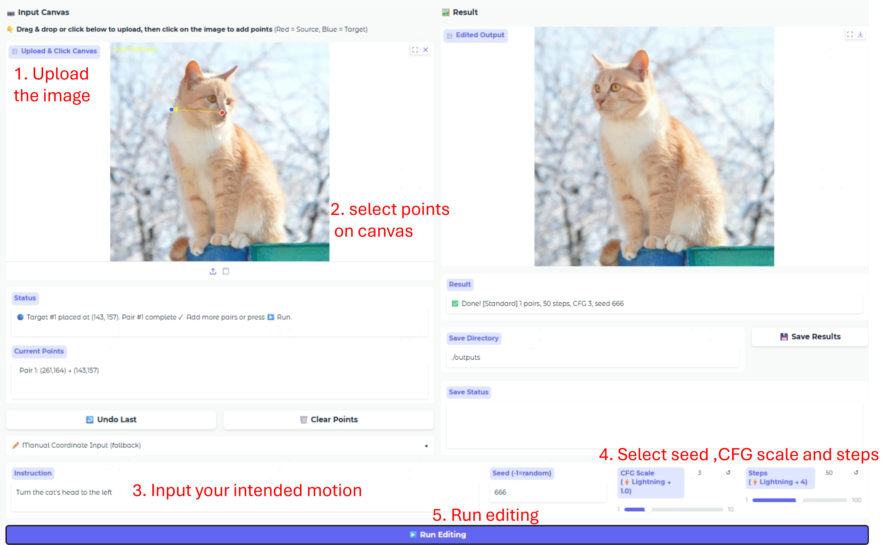

<div align="center">

<h2>Text-Vision Co-Instructed Image Editing</h2>

[Chenxi Xie](https://github.com/xiechenxi99)<sup>1,2</sup> |
Yuhui Wu<sup>1,2</sup> |
Qiaosi Yi<sup>1,2</sup> |
[Lei Zhang](https://www4.comp.polyu.edu.hk/~cslzhang)<sup>1,2</sup>

<sup>1</sup>The Hong Kong Polytechnic University, <sup>2</sup>OPPO Research Institute

[](https://xiechenxi99.github.io/TVEdit/)&nbsp;
[](https://arxiv.org/abs/)&nbsp;
[](https://github.com/PolyU-VCLab/TVEdit)&nbsp;
[](https://huggingface.co/VCLab-PolyU/TVEdit/tree/main)

</div>

---


## ⏰ Update

- [x] **2026.6.13**: The TVEdit project page and arXiv preprint are released.

- [x] **2026.6.13**: The inference code and TV-Edit model are available.

- [ ] Release dataset.

- [ ] Release training code.

## ⚙ Dependencies and Installation

```shell

## git clone this repository

git clone https://github.com/xiechenxi99/TVEdit.git

cd TVEdit

# create an environment

conda create -n TVEdit python=3.10

conda activate TVEdit

pip install --upgrade pip

pip install torch==2.5.0+cu121 torchvision==0.20.0+cu121 --index-url https://download.pytorch.org/whl/cu121

pip install transformers==4.52.4 pytorch-lightning==2.4.0 diffusers==0.35.1

```

## 🏂 Quick Inference

1. Download the base model checkpoint: [Qwen-Image-Edit](https://huggingface.co/Qwen/Qwen-Image-Edit).

2. Download the trained TV-Edit weights: [TVEdit-Qwen-Image-Edit]().

3. [Optional] TV-Edit supports existing trained acceleration LoRA for 4-step editing: [Qwen-Image-Edit-4step](https://huggingface.co/lightx2v/Qwen-Image-Lightning/blob/main/Qwen-Image-Edit-Lightning-4steps-V1.0-bf16.safetensors).

4. Launch the Gradio demo:

```shell
python gradio_demo.py
```



After launching the Gradio demo, use the interface as follows:

1. Specify the directory of the pretrained editing model, e.g., Qwen-Image-Edit.

2. Specify the path to the downloaded TV-Edit weights.

3. [Optional] Specify the directory of the downloaded acceleration LoRA.

4. Click the **Load Model** button to initialize the models.

5. Upload the image to be edited.

6. Draw the desired point trajectories on the canvas to indicate the spatial control.

7. Enter the expected semantic change as the textual editing instruction.

8. Adjust the CFG scale and random seed. For inference without acceleration LoRA, we recommend CFG 2.5-3.5 with 50 steps. With acceleration LoRA, use CFG 1 with 4 steps.

9. Click the **Runing Edit** button to generate the edited image.

## 🔗 Citations

```

@article{xie2026tvedit,

  title={Text-Vision Co-Instructed Image Editing},

  author={Xie, Chenxi and Wu, Yuhui and Yi, Qiaosi and Zhang, Lei},

  year={2026}

}

```

## ©️ License

This project is released under the [Apache 2.0 license](LICENSE).

## 📧 Contact

If you have any questions, please contact xiechenxi99@gmail.com.